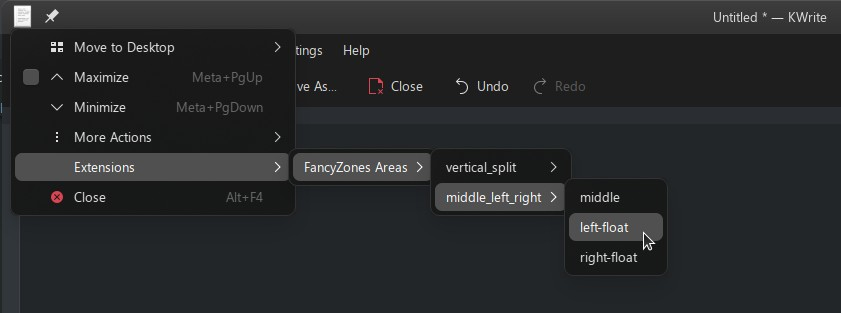

# KWin_FancyZones

> **DISCLAIMER**: This is a very pre-mature version, using some shortcuts to achieve its goal. IT IS STILL UNDER DEVELOPMENT AND WILL BE MORE USER-FRIENDLY SOON. **But that shouldn't stop you from using it successfully!**
> P.S.: Contribute to make it better!

This is a project that aims to bring FancyZones functionality to KWin which is the default windows manager for Plasma Desktop from KDE 💖 (Thanks to them for all the open-source stuff)

## Using it

Follow steps below to install it. After installing it, you can simply click on the window's user action menu. It can be manually invoked by clicking on the extreme top-left corener of a window with a title bar OR by selecting the window you want to manipulate and using the default keyboard shortcut `Alt + F3`.

Then open the `Extensions` dropdown in which you'll have to open the `FancyZones` area dropdown.

In here you'll find multiple dropdowns with the names of configurations (you created) and opening them will list the available areas IN THAT configuration, and clicking them will reposition and resize the window.



## Installation

1. clone/download this repo and open the folder in which this README is present (in your download location)
2. open a terminal **in the folder**
3. Run `make install` to install the script
4. Run `make update` to enable the script

You can also do `make disable` and `make enable` to manually disable/enable, OR you can use the `system settings` in KDE to enable/disable.

> To remove it, just run `make remove` from the terminal *in that folder*.

## Customization

1. If you want to customize the areas, you'll need to edit the `AREAS_AND_DIMS` constant in the file `./contents/code/main.js`.
2. After modification of the files based on steps given below, you need to execute `make update` from the folder in which this README is present.

> If it doesn't work, manually execute `make disable` and `make enable` after `make update`.

### Customizing `AREAS_AND_DIMS`

`AREAS_AND_DIMS` is a constant array of configurations in JSON format.  
Each configuration has the following format:

```js
{
	id: "what ever config name you want here",
	areas: [
		{}, {}, ....
	]
}
```

Each of the `area` within a configuration has the following format:

```js
{
	id: "area name",
	x: 0,
	y: 0,
	width: 0.5,
	height: 1,
}
```

where `x`, `y`, `width` and `height` are floats with values between `0` and `1`.  
`x` is the coordinate of the window's *top-left corner* measured horizontally rightward from `0`, where `0` refers the *top-left corner* of your screen and `1` is the *top-right corner*.  
`y` is the coordinate of the window's *top-left corner* measured vertically downward from `0`, where `0` refers the *top-left corner* of your screen and `1` is the *top-right corner*.  
`width` is the width of the window with respect to that of your screen. Screen width is considered to be `1`.   
`height` is the width of the window with respect to that of your screen. Screen width is considered to be `1`.   

### An example configuration

```js
const AREAS_AND_DIMS = [
	{
		id: "vertical_split",
		areas: [
			{
				id: "left",
				x: 0,
				y: 0,
				width: 0.5,
				height: 1,
			},
			{
				id: "right",
				x: 0.5,
				y: 0,
				width: 0.5,
				height: 1,
			}
		]
	},
	{
		id: "middle_left_right",
		areas: [
			{
				id: "middle",
				x: 0.20,
				y: 0,
				width: 0.60,
				height: 1,
			},
			{
				id: "left-float",
				x: 0,
				y: 0.25,
				width: 0.35,
				height: 0.50,
			},
			{
				id: "right-float",
				x: 0.65,
				y: 0.25,
				width: 0.35,
				height: 0.50,
			}
		]
	}
]
```

How it looks in the menu:


## LICENSE

THis project uses the GNU GENERAL PUBLIC LICENSE Version 3. For more info, refer the LICENSE file or for easier understanding, [this link](https://choosealicense.com/licenses/gpl-3.0/#)

## Contribution

If things aren't working for you PLEASE do file an issue. I am not a seasoned KDE developer. I'm barely a beginner. The information out there seems to be a bit sparse, so I'm trying to work things out as I go.

Please do contribute if your have ideas, or experience or both!  
You can suggest ideas by filing an issue.

I'll soon add a UI for managing the `AREAS_AND_DIMS` constant. If someone can do that, it would be amazing.


## Helpful Developer info

Installing script:
`kpackagetool5 --type=KWin/Script -i .` from the directory in which this readme is present

To update it, use: `kpackagetool5 --type=KWin/Script -u .`

To remove the script:
`kpackagetool5 --type=KWin/Script -r .`

> updating and reinstalling od the same thing. But they don't change the behavior of the already registered script. To do that, you'll need to `disable` and `enable` it.

TO enable it: `kwriteconfig5 --file kwinrc --group Plugins --key KWin_FancyZonesEnabled true && qdbus org.kde.KWin /KWin reconfigure`

To disable it: `kwriteconfig5 --file kwinrc --group Plugins --key KWin_FancyZonesEnabled false && qdbus org.kde.KWin /KWin reconfigure`

Global pre-installed list:
`kpackagetool5 --type=KWin/Script --list --global`

User downloaded list:
`kpackagetool5 --type=KWin/Script --list --global`


